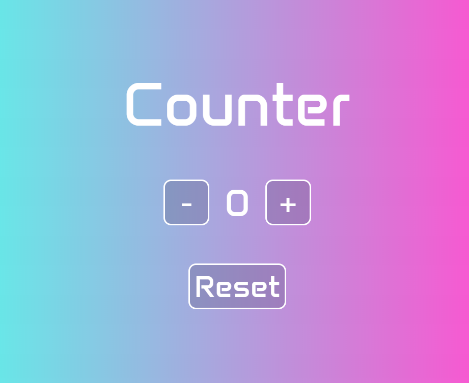

# ProgettoJavaScriptBasics
 

  
  <h1>Counter</h1>

## Features

* Plus button: +1
* Minus button: -1
* Reset button: value 0

## Quick start

Here you can try the Counter web app:

<a href="https://jsbasicsjessicadabennini.netlify.app/">LINK</a>

